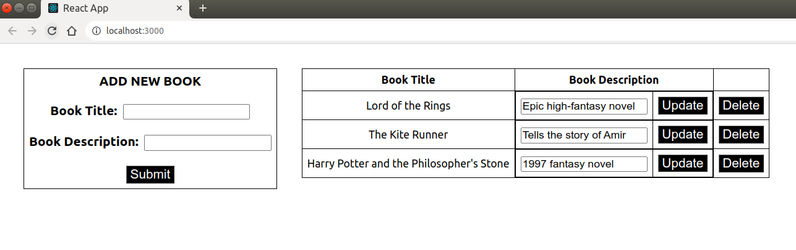
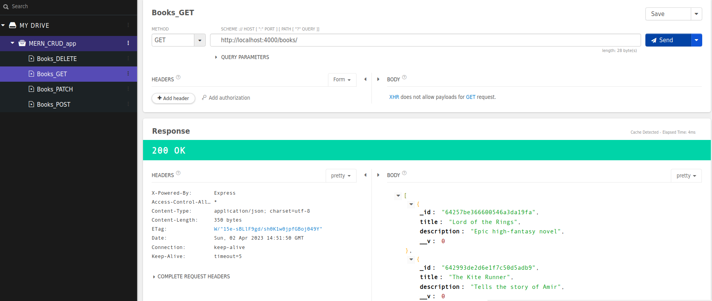
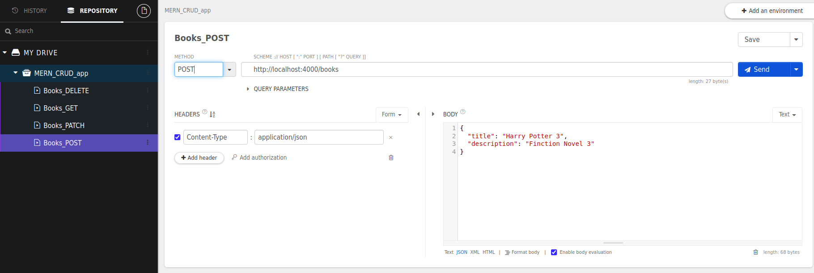
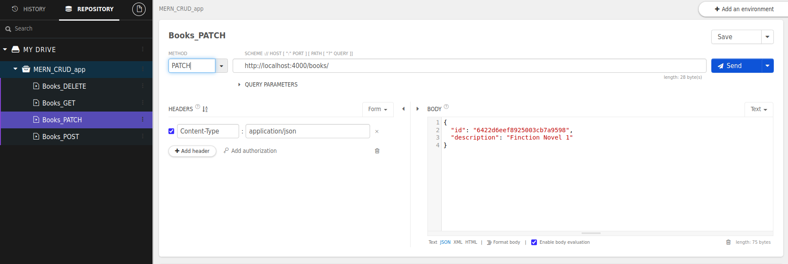
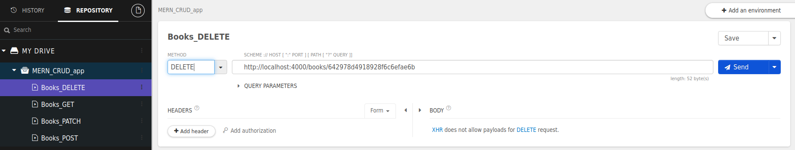

# MERN-Stack-CRUD-App
MERN Stack (MongoDB, Express.js, React, Node.js) CRUD (Create, Read, Update, Delete) App

### HOW TO RUN:
```console
cd be-backend-app
npm install
npm start
```
```console
cd fe-frontend-app
npm install
npm start
```

### DESCRIPTIONS:
- Local **MongoDB** stores the book data.
- **be-backend-app** connects DB and manage data via Node.js, Express.js.
- be-backend-app uses **4000 port**. (localhost:4000)
- **fe-frontend-app** visualizes the data via React.
- fe-frontend-app uses **3000 port**. (localhost:3000)

### SCREENSHOTS:
<kbd></kbd>
<br/><br/>
<kbd></kbd>
<br/><br/>
<kbd></kbd>
<br/><br/>
<kbd></kbd>
<br/><br/>
<kbd></kbd>
<br/><br/>
